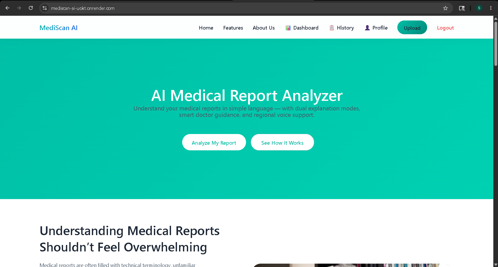
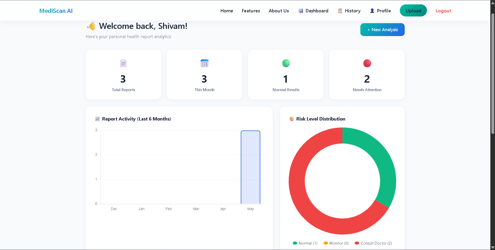
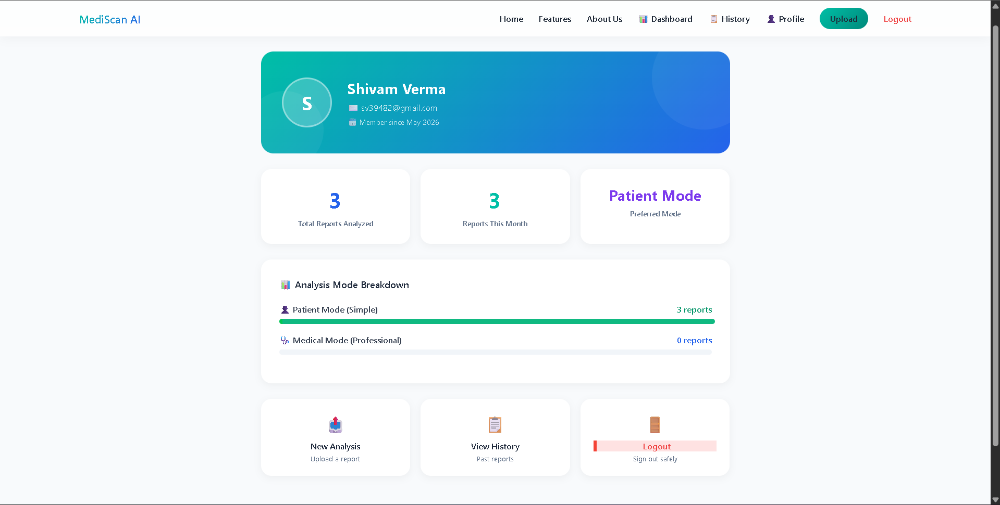
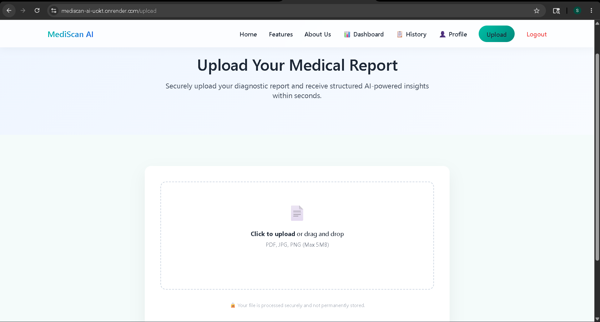
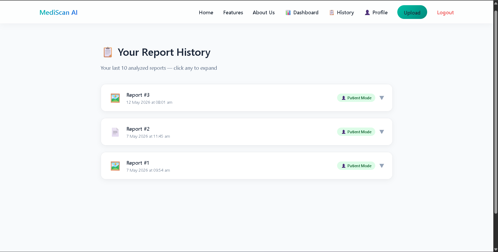

# 🏥 MediScan AI — AI-Powered Medical Report Analyzer


> A full-stack AI web application that analyzes medical reports and explains them in simple language for patients or detailed clinical insights for professionals.

**🔗 Live Demo:** [https://mediscan-ai-uokt.onrender.com](https://mediscan-ai-uokt.onrender.com)

---

## 📸 Screenshots

| Home Page | Dashboard | Profile |
|-----------|-----------|---------|
|  |  |  |

| Upload & Analysis | Report History |
|-------------------|----------------|
|  |  |

---

## ✨ Features

### 🔍 Core Analysis
- **PDF & Image Support** — Upload blood reports, X-rays, prescriptions as PDF or JPG/PNG
- **Dual Explanation Modes** — Patient Mode (simple language) and Medical Mode (clinical depth)
- **AI Risk Indicator** — Automatically categorizes results as 🟢 Normal, 🟡 Monitor, or 🔴 Consult Doctor
- **Gemini Vision** — Analyzes medical images directly using Google Gemini Vision API

### 💬 Interaction
- **Chat Follow-up** — Ask questions about your report after analysis
- **Text-to-Speech** — Listen to your report explained aloud in your preferred language
- **Multilingual Translation** — Hindi, Marathi, Gujarati, Tamil support
- **PDF Download** — Download a clean summary of your analysis

### 👤 User Features
- **Secure Authentication** — Signup/Login with bcrypt password hashing and Passport.js
- **Report History** — Last 10 analyzed reports saved per user
- **Personal Dashboard** — Charts showing report activity, risk distribution, and mode usage
- **Profile Page** — User stats including total reports, monthly activity, and preferred mode

### 📱 Design
- **Fully Mobile Responsive** — Works perfectly on all screen sizes
- **Camera Capture** — On mobile, take a photo of your report directly
- **Step-by-step Loading** — Animated progress indicators during analysis
- **Clean UI** — Professional design with smooth animations

---

## 🛠️ Tech Stack

| Category | Technology |
|----------|-----------|
| **Backend** | Node.js, Express.js |
| **Frontend** | EJS, HTML5, CSS3, JavaScript |
| **Database** | MongoDB Atlas, Mongoose |
| **AI** | Google Gemini AI (`gemini-flash-latest`) |
| **Auth** | Passport.js, bcryptjs, express-session |
| **File Handling** | Multer |
| **PDF Parsing** | pdf-parse |
| **Charts** | Chart.js |
| **Deployment** | Render |
| **Session Store** | connect-mongo |

---

## 📁 Project Structure

```
mediscan_ai/
├── config/
│   └── passport.js          # Passport.js local strategy
├── middleware/
│   └── auth.js              # Authentication middleware
├── models/
│   ├── User.js              # User schema
│   └── Report.js            # Report schema
├── public/
│   ├── css/
│   │   ├── home.css
│   │   ├── upload.css
│   │   ├── features.css
│   │   ├── aboutUs.css
│   │   ├── dashboard.css
│   │   └── profile.css
│   └── images/
├── routes/
│   ├── mainRoutes.js        # Main app routes
│   └── authRoutes.js        # Auth routes
├── services/
│   ├── aiService.js         # Gemini AI integration
│   └── pdfService.js        # PDF text extraction
├── utils/
│   └── uploadConfig.js      # Multer configuration
├── views/
│   ├── partials/
│   │   ├── header.ejs
│   │   ├── navbar.ejs
│   │   └── footer.ejs
│   ├── home.ejs
│   ├── upload.ejs
│   ├── features.ejs
│   ├── aboutUs.ejs
│   ├── dashboard.ejs
│   ├── profile.ejs
│   ├── history.ejs
│   ├── login.ejs
│   └── signup.ejs
├── app.js                   # Main application entry
├── .env                     # Environment variables (not committed)
└── package.json
```

---

## 🚀 Getting Started

### Prerequisites
- Node.js v18+
- MongoDB Atlas account
- Google Gemini API key

### Installation

**1. Clone the repository**
```bash
git clone https://github.com/gittershivam/Mediscan-AI.git
cd Mediscan-AI
```

**2. Install dependencies**
```bash
npm install
```

**3. Create `.env` file in the root directory**
```env
GOOGLE_API_KEY=your_google_gemini_api_key
MONGO_URI=your_mongodb_atlas_connection_string
SESSION_SECRET=your_session_secret_key
```

**4. Start the development server**
```bash
npm run dev
```

**5. Open your browser**
```
http://localhost:3000
```

---

## 🔑 Environment Variables

| Variable | Description |
|----------|-------------|
| `GOOGLE_API_KEY` | Google Gemini API key from [Google AI Studio](https://makersuite.google.com/) |
| `MONGO_URI` | MongoDB Atlas connection string |
| `SESSION_SECRET` | Secret key for express-session |

---

## 🌐 API Routes

### Auth Routes (`/auth`)
| Method | Route | Description |
|--------|-------|-------------|
| GET | `/auth/signup` | Signup page |
| POST | `/auth/signup` | Create account |
| GET | `/auth/login` | Login page |
| POST | `/auth/login` | Authenticate user |
| GET | `/auth/logout` | Logout user |

### Main Routes
| Method | Route | Description |
|--------|-------|-------------|
| GET | `/` | Home page |
| GET | `/upload` | Upload page (protected) |
| POST | `/analyze` | Analyze report (protected) |
| POST | `/translate` | Translate analysis |
| POST | `/chat` | Chat with report |
| GET | `/history` | Report history (protected) |
| GET | `/dashboard` | Personal dashboard (protected) |
| GET | `/profile` | User profile (protected) |
| GET | `/features` | Features page |
| GET | `/aboutUs` | About page |

---

## 🤖 How It Works

```
User uploads PDF/Image
        ↓
File type detected (PDF → pdf-parse, Image → Gemini Vision)
        ↓
Text/Image sent to Google Gemini AI with mode prompt
        ↓
AI analyzes and returns structured HTML with risk indicator
        ↓
Result displayed with TTS, translation, chat, and download options
        ↓
Report saved to MongoDB linked to user account
```

---

## 🔒 Security

- Passwords hashed with **bcryptjs** (salt rounds: 10)
- Sessions stored in **MongoDB** via connect-mongo
- Protected routes using **Passport.js** middleware
- Uploaded files deleted from server after analysis
- Environment variables never committed to repository

---

## 📊 AI Prompting Strategy

MediScan AI uses carefully crafted prompts for Google Gemini:

- **Simple Mode** — Instructs Gemini to act as a compassionate medical assistant explaining findings in plain language
- **Medical Mode** — Instructs Gemini to act as a senior medical consultant providing clinical assessments
- **Risk Classification** — Forces Gemini to prefix every response with exactly one of three HTML status headers
- **Translation** — Instructs Gemini to translate HTML content while preserving all tags
- **Chat** — Maintains conversation history with full report context on every message

---

## 🚀 Deployment

This project is deployed on **Render** with the following configuration:

- **Build Command:** `npm install`
- **Start Command:** `node app.js`
- **Environment Variables:** Set in Render dashboard

---

## 📝 License

This project is open source and available under the [MIT License](LICENSE).

---

## 🙌 Author

**Shivam Verma**

- GitHub: [@gittershivam](https://github.com/gittershivam)
- LinkedIn: [Shivam Verma](https://www.linkedin.com/in/shivam-verma-6a516527b/)
- Live Project: [https://mediscan-ai-uokt.onrender.com](https://mediscan-ai-uokt.onrender.com)

---

> ⚠️ **Disclaimer:** MediScan AI is for educational purposes only. It does not provide medical diagnosis or replace professional medical advice. Always consult a qualified healthcare professional for medical decisions.
